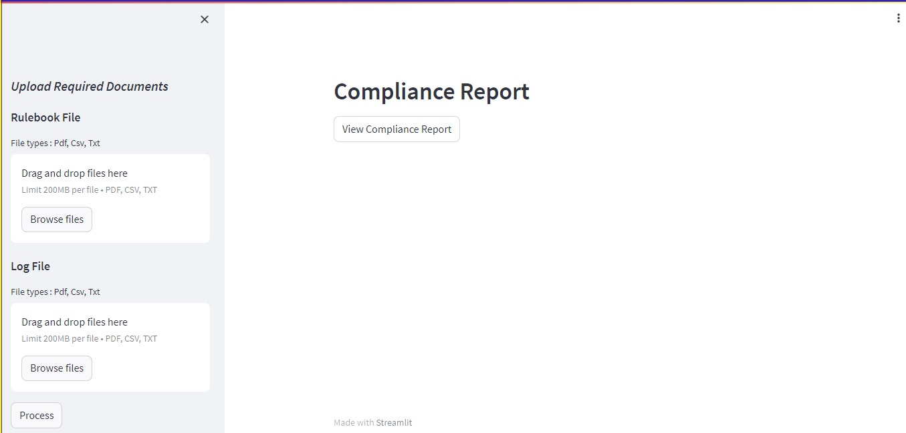
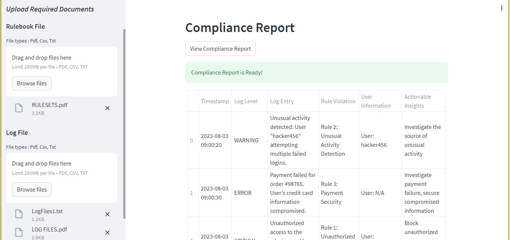

# Fliplog Analyser

This project analyzes logs, system configurations,
access controls, and user privileges to check for compliance with security policies and
standards.


## Features

- Effortless User Experience
- Comprehensive Risk Analysis
- Real-time Previews
- Multi-Format Log Compatibility
- High Accuracy/Precision/Recall


## Installation

To install Fliplog Analyser, you need to have Python and pip installed. Then, run the following command:

```bash
  pip install -r requirements.txt
````
This will install Fliplog Analyser and its dependencies in your system.

Download the LLM Model "alpaca-7b-native-enhanced" model from the below link.

https://huggingface.co/Pi3141/alpaca-7b-native-enhanced/blob/main/ggml-model-q4_1.bin
    
Download the Embedding Model "all-MiniLM-L6-v2" from the below link.

https://huggingface.co/sentence-transformers/all-MiniLM-L6-v2

Add the locations wherever, you have completed the downloads to backend.py.

Installation is complete.

## Approach 


- Rule Set Upload: To begin, navigate to the top-left menu and upload the system rulesets. Ensure they are in PDF format for compatibility.

- Log Submission: Next, Submit the system logs for analysis. Accepted formats include PDF, CSV, or TXT. 

- Processing Initiation: Click on the "Process" button to trigger the analysis. 

- Processing Confirmation: You will receive a confirmation message once the processing is successfully completed. 

- Compliance Report Access: To access the compliance report, simply click on the "View Compliance Report" button. Review the findings and make informed decisions.
## Usage/Examples

The following commands need to be executed in the order in GitBash.
```bash 
virtualenv venv
```

```bash
source venv/Scripts/activate
```

```bash
streamlit run backend.py 
```


## Screenshots

### The interface looks like 



## Team 

This project is created by - 
- Aditya Gurjar 
- Samyak Jain 
- Sameer Bajpai
## 🔗 Links

- [Aditya's Github](https://github.com/gurjaraditya) 
- [Samyak's Github](https://github.com/Sam9685)
- [Sameer's Github](https://github.com/bajpai13)

 


